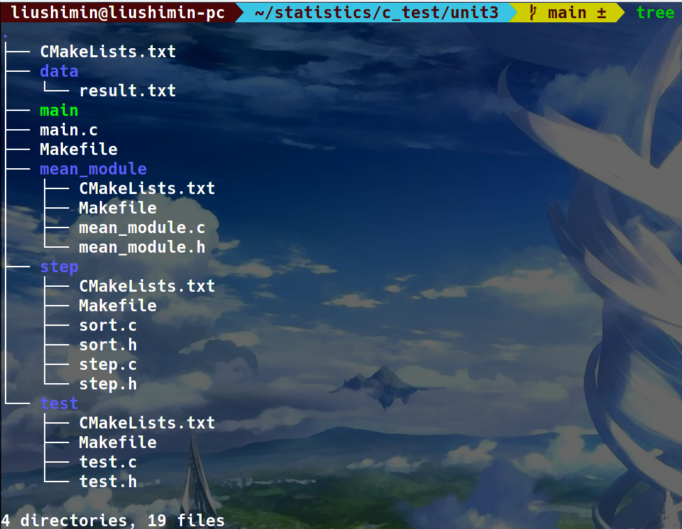

# 逐步回归

项目结构



## main.c

```c
#include "./test/test.h"
#include "./mean_module/mean_module.h"
#include "./step/step.h"
#include<math.h>
#include<stdio.h>
#include<stdlib.h>

int main(){
    FILE* fp=fopen("./data/result.txt","r");
    int j=0,i=0;
    double f1,f2;
    double** arr=(double**)malloc(sizeof(double*)*89);
    double** correlation_arr;
    double* stepwise_regression_arr;
    double* predict_arr=(double*)malloc(sizeof(double)*88);
    f1=f2=3.28;
    for(int i=0;i<89;i++)
        *(arr+i)=(double*)malloc(sizeof(double)*837);
    while(!feof(fp)){
        if(j==837){
            j=0;
            i++;
        }
        fscanf(fp,"%lf",*(arr+i)+j);
        j++;
    }
    for(int i=0;i<88;i++)
        *(predict_arr+i)=*(*(arr+i)+833);
    printf("%f\n",predict(arr,89,833,predict_arr));
    printf("%f\n",r(arr,89,833));
    return 0;
}
```

[mean_module](./mean_module/mean_module.html)

[step](./step/step.html)

[test](./test/test.html)